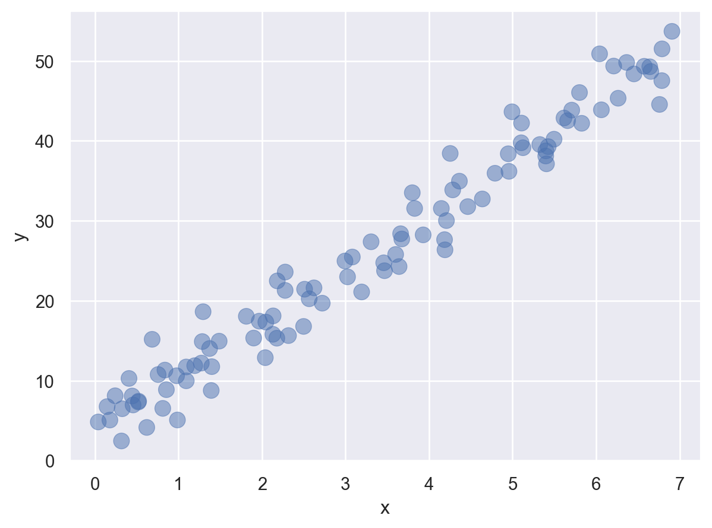

## Milestone 1: Project Idea

Lorem ipsum odor amet, consectetuer adipiscing elit. Sit eu class placerat erat nostra. Dictum sed nibh amet vel sollicitudin curabitur himenaeos ante. Gravida risus conubia per ultrices ligula nascetur. Nam fusce amet ad ante sed aenean! Quis lacus vulputate bibendum facilisi condimentum sit.

## Milestone 2: Data Story

Lorem ipsum odor amet, consectetuer adipiscing elit. Sit eu class placerat erat nostra. Dictum sed nibh amet vel sollicitudin curabitur himenaeos ante. Gravida risus conubia per ultrices ligula nascetur. Nam fusce amet ad ante sed aenean! Quis lacus vulputate bibendum facilisi condimentum sit.

Mauris volutpat iaculis enim nam taciti est ipsum dui. Eu facilisi erat euismod per nulla lacus. Neque duis bibendum conubia class fusce fames. Ultrices ultricies in hac ornare platea. Aliquam sociosqu habitant conubia porta sagittis sociosqu aenean? Nunc eget accumsan nunc lacus, urna lacus? Est quisque quis iaculis phasellus nisl. Purus nisi cursus convallis, tristique mauris sagittis nibh.

## Milestone 3: DAG

```{mermaid}
flowchart LR
  A(A) --> B(B)
  A --> C(C)
  C --> B
  D(D) --> Y
  B --> Y{Y}
```

## Milestone 4: Identification Strategy

Here's my adjustment set following the backdoor criteria:

- Lorem ipsum odor amet, consectetuer adipiscing elit.
- Euismod a inceptos torquent laoreet dapibus quis quam laoreet.
- Magnis lacinia ante aliquam posuere parturient lobortis.

## Milestone 5: Simulate Data and Recover Parameters

```{python}
import numpy as np
import polars as pl
import seaborn.objects as so
from sklearn.linear_model import LinearRegression

np.random.seed(42)

# Set the parameter values.
beta0 = 3
beta1 = 7
n = 100

sim_data = (
    # Simulate predictors using appropriate np.random distributions.
    pl.DataFrame({
        'x': np.random.uniform(0, 7, size = n)
    })
    # Use predictors and parameter values to simulate the outome.
    .with_columns([
        (beta0 + beta1 * pl.col('x') + np.random.normal(0, 3, size = n)).alias('y')
    ])
)

sim_data

# Specify the X matrix and y vector.
X = sim_data[['x']]
y = sim_data['y']

# Create a linear regression model.
model = LinearRegression(fit_intercept=True)

# Train the model.
model.fit(X, y)

# Print the coefficients
print(f'Intercept: {model.intercept_}')
print(f'Slope: {model.coef_[0]}')

# Have you recovered the parameters?
```

Lorem ipsum odor amet, consectetuer adipiscing elit. Sagittis interdum fringilla sagittis platea eget dictum sodales non. Nec arcu porta felis eros sem accumsan? Sit quis ridiculus, ligula dictum ex luctus.

## Milestone 6: Exploratory Data Analysis

Aliquam sociosqu habitant conubia porta sagittis sociosqu aenean? Nunc eget accumsan nunc lacus, urna lacus? Est quisque quis iaculis phasellus nisl. Purus nisi cursus convallis, tristique mauris sagittis nibh.

```{python}
#| eval: false
(so.Plot(sim_data, x = 'x', y = 'y')
  .add(so.Dot(pointsize = 10, alpha = 0.5))
)
```

{fig-align="center"}

Mauris volutpat iaculis enim nam taciti est ipsum dui.

## Milestone 7: Estimate Causal Effects

```{python}
# eval: false
import bambi as bmb
import arviz as az

# Import foxes data.
foxes = pl.read_csv('../data/foxes.csv')

# Use Bambi to estimate the direct causal effect of avgfood on weight.
bambi_model_01 = bmb.Model('weight ~ avgfood + groupsize', foxes.to_pandas())
bambi_model_01
```

```
       Formula: weight ~ avgfood + groupsize
        Family: gaussian
          Link: mu = identity
  Observations: 116
        Priors: 
    target = mu
        Common-level effects
            Intercept ~ Normal(mu: -0.0, sigma: 2.4892)
            avgfood ~ Normal(mu: 0.0, sigma: 2.5)
            groupsize ~ Normal(mu: 0.0, sigma: 2.5)
        
        Auxiliary parameters
            sigma ~ HalfStudentT(nu: 4.0, sigma: 0.9957)
```

```{python}
#| eval: false
# Calls pm.sample().
bambi_fit_01 = bambi_model_01.fit()
az.plot_trace(bambi_fit_01, compact = False)
```

{fig-align="center"}

```{python}
#| eval: false
# Visualize marginal posteriors.
az.plot_forest(bambi_fit_01, var_names = ['avgfood', 'groupsize'], combined = True, hdi_prob = 0.95)
```

{fig-align="center"}

Controlling for group size, average food has a positive impact on fox weight.

## Milestone 8: Intermediate Presentation

See my intermediate presentation [slides](https://github.com/marcdotson/causal-inference/blob/main/presentations/multivariate-models.html). To summarize some feedback:

- Lorem ipsum dolor sit amet, consectetur adipiscing elit, sed do eiusmod tempor incididunt ut labore et dolore magna aliqua.
- Ut enim ad minim veniam, quis nostrud exercitation ullamco laboris nisi ut aliquip ex ea commodo consequat.
- Duis aute irure dolor in reprehenderit in voluptate velit esse cillum dolore eu fugiat nulla pariatur.
- Excepteur sint occaecat cupidatat non proident, sunt in culpa qui officia deserunt mollit anim id est laborum.

